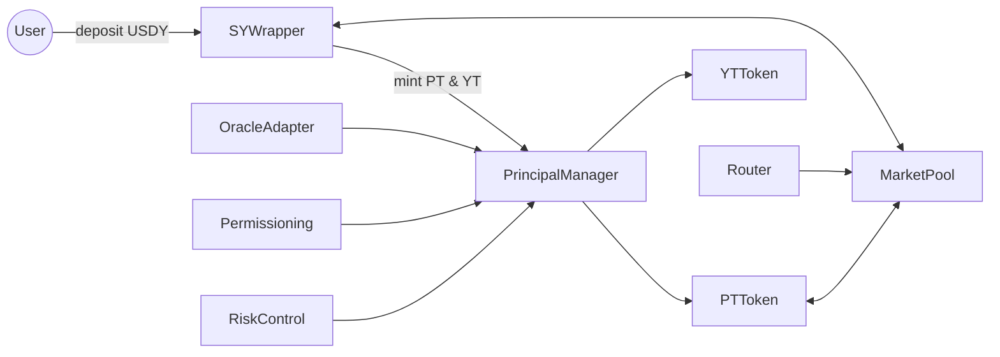

# Principal Protocol Architecture

## Overview

This document describes high-level contract interactions and data flows for the Principal Protocol.

## Contract components

- `PrincipalManager` — protocol coordinator, issues configuration and maturities.
- `SYWrapper` — holds underlying USDY, tracks reference-value, handles deposit/withdraw.
- `PTToken` / `YTToken` — Soroban token contracts for principal and yield instruments.
- `MarketPool` — PT/SY liquidity pool for trading.
- `Router` — coordinates multi-step flows (wrap → split → trade → redeem).
- `OracleAdapter` — fetches USDY/USDC reference values.
- `Permissioning` — eligibility checks and compliance registry.
- `RiskControl` — pause, circuit breakers, and emergency procedures.

## Interaction diagram

## Maturity settlement flow

1. `OracleAdapter` publishes USDY/USDC reference value with timestamp `t_ref`.
2. At maturity, `PrincipalManager` consults `OracleAdapter` to compute redemption quantities.
3. `PrincipalManager` burns PT and YT, then instructs `SYWrapper` to transfer underlying USDY to redeemers.

## Notes

- The architecture is asset-agnostic and supports any yield-bearing asset wrapper, with USDY shown as the first example.
- All state-changing entrypoints must validate caller provenance and permissioning.
- Oracle freshness, permissioning checks, and risk controls are required preconditions for settlement.
