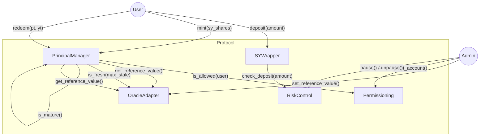
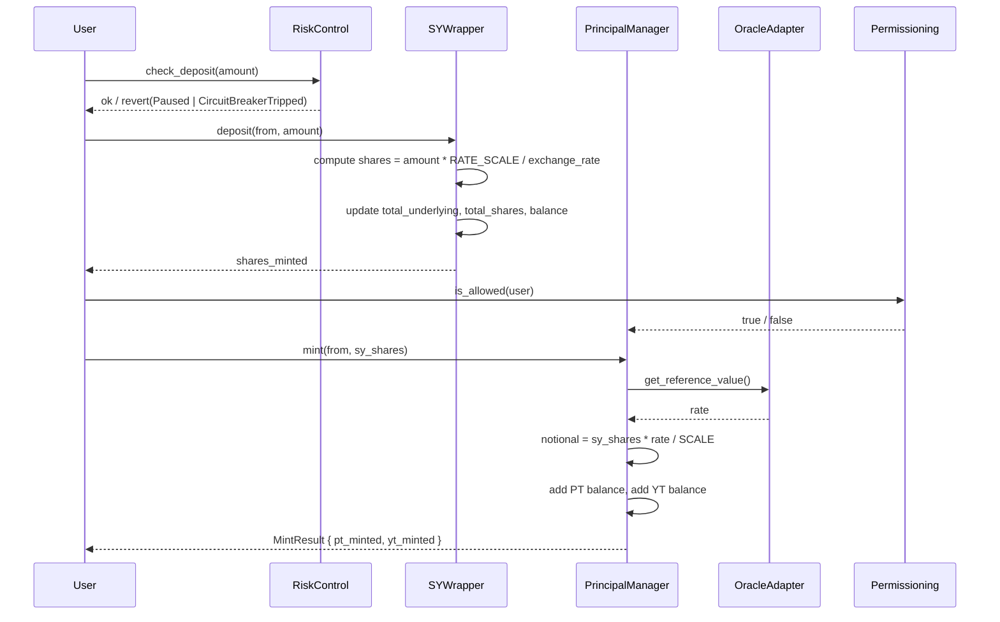
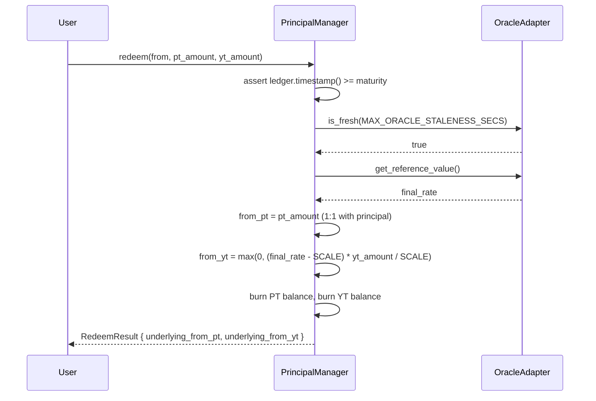

# Principal Protocol Architecture

## 1. Overview

This document describes contract interactions, data flows, storage design, and sequence diagrams for the Principal Protocol. Five Soroban contracts work together to implement yield tokenization on Stellar.

## 2. Contract components

| Contract | Crate | Role |
|---|---|---|
| `OracleAdapter` | `principal_oracle_adapter` | Stores the USDY/USDC reference value submitted by a trusted admin. Provides freshness checks via `env.ledger().timestamp()`. |
| `Permissioning` | `principal_permissioning` | Eligibility registry: per-account and per-asset allow/deny flags. Used by PrincipalManager on every mint and redemption. |
| `SYWrapper` | `principal_sy_wrapper` | Holds the underlying yield-bearing asset. Issues SY shares at a rolling exchange rate that increases as yield accrues. |
| `PrincipalManager` | `principal_manager` | Splits SY shares into PT (fixed claim) and YT (yield claim). Enforces maturity and oracle freshness at redemption. |
| `RiskControl` | `principal_risk_control` | Global pause flag with multi-pauser roles. Rolling 24-hour deposit circuit breaker. |

## 3. Contract interaction diagram



## 4. Deposit and mint sequence



## 5. Maturity redemption sequence



## 6. Storage tier design

Soroban provides three storage tiers. This protocol uses them as follows:

| Tier | Used for | TTL |
|---|---|---|
| `instance()` | Contract config: admin, addresses, flags, oracle price, totals | Extends with contract instance |
| `persistent()` | Per-user data: SY balances, PT balances, YT balances, eligibility flags | Must be explicitly extended; default ~30 days |
| `temporary()` | Not used in v1 | — |

### OracleAdapter storage keys

| Key | Type | Tier | Description |
|---|---|---|---|
| `Admin` | `Address` | instance | Contract admin |
| `Price` | `i128` | instance | Latest reference value (scaled ×10⁷) |
| `Timestamp` | `u64` | instance | Unix timestamp of latest price |

### Permissioning storage keys

| Key | Type | Tier | Description |
|---|---|---|---|
| `Admin` | `Address` | instance | Contract admin |
| `AccountAllowed(addr)` | `bool` | persistent | Global account eligibility |
| `AssetAllowed(addr, asset)` | `bool` | persistent | Per-asset account eligibility |

### SYWrapper storage keys

| Key | Type | Tier | Description |
|---|---|---|---|
| `Admin` | `Address` | instance | Contract admin |
| `Underlying` | `Address` | instance | Underlying token contract |
| `TotalUnderlying` | `i128` | instance | Total underlying held |
| `TotalShares` | `i128` | instance | Total SY shares outstanding |
| `Paused` | `bool` | instance | Pause flag |
| `Balance(addr)` | `i128` | persistent | SY share balance per holder |

### PrincipalManager storage keys

| Key | Type | Tier | Description |
|---|---|---|---|
| `Admin` | `Address` | instance | Contract admin |
| `SYWrapper` | `Address` | instance | SYWrapper contract |
| `Oracle` | `Address` | instance | OracleAdapter contract |
| `Permissioning` | `Address` | instance | Permissioning contract |
| `Maturity` | `u64` | instance | Maturity Unix timestamp |
| `Paused` | `bool` | instance | Pause flag |
| `TotalPT` | `i128` | instance | Total PT outstanding |
| `TotalYT` | `i128` | instance | Total YT outstanding |
| `PTBalance(addr)` | `i128` | persistent | PT balance per holder |
| `YTBalance(addr)` | `i128` | persistent | YT balance per holder |
| `SYDeposit(addr)` | `i128` | persistent | SY shares deposited per minter |

### RiskControl storage keys

| Key | Type | Tier | Description |
|---|---|---|---|
| `Admin` | `Address` | instance | Contract admin |
| `Paused` | `bool` | instance | Global pause flag |
| `Pauser(addr)` | `bool` | instance | Registered pauser role |
| `CbLimit` | `i128` | instance | Circuit breaker limit (0 = disabled) |
| `CbVolume` | `i128` | instance | Cumulative volume in current window |
| `CbWindowStart` | `u64` | instance | Window start timestamp |

## 7. Exchange rate invariant

The SYWrapper exchange rate is defined as:

```
exchange_rate = total_underlying * RATE_SCALE / total_shares
```

where `RATE_SCALE = 10_000_000` (1×10⁷).

At inception (no shares): `exchange_rate = RATE_SCALE` (1:1).

On deposit of `u` underlying units:
```
shares_minted = u * RATE_SCALE / exchange_rate
```

On withdrawal of `s` shares:
```
underlying_returned = s * exchange_rate / RATE_SCALE
```

As the underlying yield-bearing asset accrues yield, `total_underlying` increases relative to `total_shares`, raising the exchange rate. Later depositors receive fewer shares per unit — they enter at the current rate.

## 8. Deployment order

Contracts must be initialized in dependency order:

```
1. OracleAdapter    (no dependencies)
2. Permissioning    (no dependencies)
3. RiskControl      (no dependencies)
4. SYWrapper        (needs: underlying token address)
5. PrincipalManager (needs: SYWrapper, OracleAdapter, Permissioning, RiskControl)
```

## 9. Notes

- The architecture is asset-agnostic. USDY is the first reference asset; any Stellar yield-bearing token can be wrapped.
- All state-changing entrypoints require `caller.require_auth()` and validate the caller against stored admin or role records.
- Oracle freshness, permissioning checks, and risk controls are mandatory preconditions for mint and redemption.
- Production PT and YT should be separate SEP-41 token contracts so they can be traded freely across wallets and DEX pools. The current `PrincipalManager` uses internal balance tracking as a prototype.
